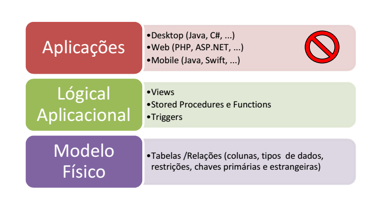

# ProjetoBD

### Descrição

Esta fase do projeto incidirá sobre a lógica aplicacional passível de ser implementada
sobre o modelo de dados (Figura 1). O objetivo será desenvolver um conjunto de
procedimentos e mecanismos que, para além de permitirem manter a integridade
referencial da base de dados, permitam a uma aplicação desempenhar as funcionalidades
básicas pressupostas pelo Sistema preconizado, através de uma API ao nível dos dados.
Por exemplo, em vez de a aplicação invocar um comando DML para inserir um novo
utilizador (mais difícil de programar, risco de SQL-Injection, etc.), a mesma poderá invocar
um procedimento disponível para o efeito, e.g., usp_registrarUtilizador(...); a mesma
lógica aplica-se a consultas, e.g., disponibilização de Views.

